# Integrate autofill feature with Github Actions

### Prerequisite
Before following this tutorial, please make sure to have an active Github account.

### Steps
There are three main steps to configure the bot to access your local repository and logbook account;
1. Fork the project to your Github account
2. Make a Github token to access the repository. This is used to make a local daily log of your logbook. 
3. Make repository secrets. These values are used to access your repository and logbook page.
4. Add Github Actions

#### Fork the project

1. Fork the [project repository](https://github.com/bernardadhitya/intern-logbook-chatbot) to your Github account
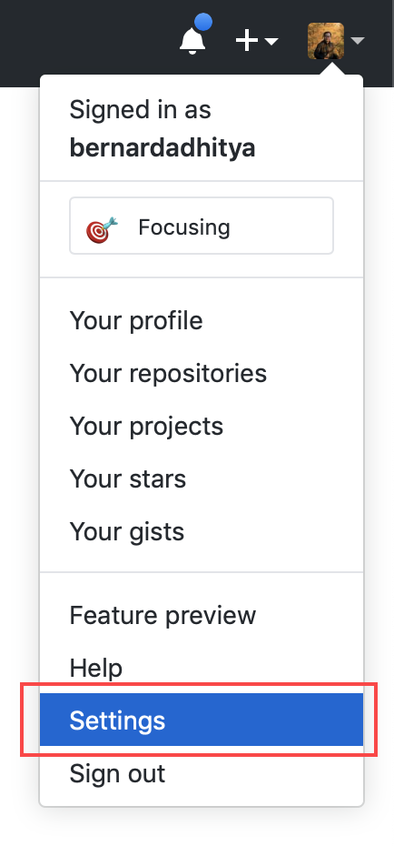

#### Make a Github access token

2. Click your profile and select "Settings"
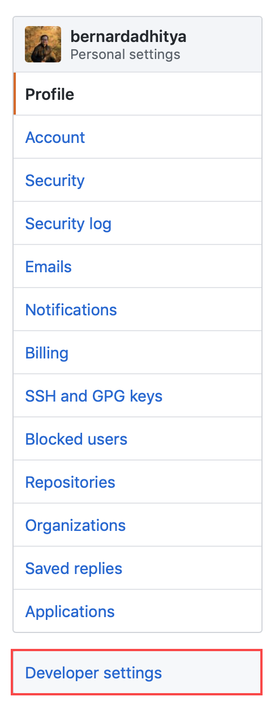

3. On the bottom left of the page, click "Developer settings"
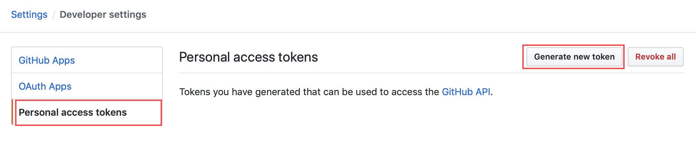

4. On the left, you will find a sidebar. Click on "Personal access token"

5. Fill in the note and check the required permissions for the bot to access the repository
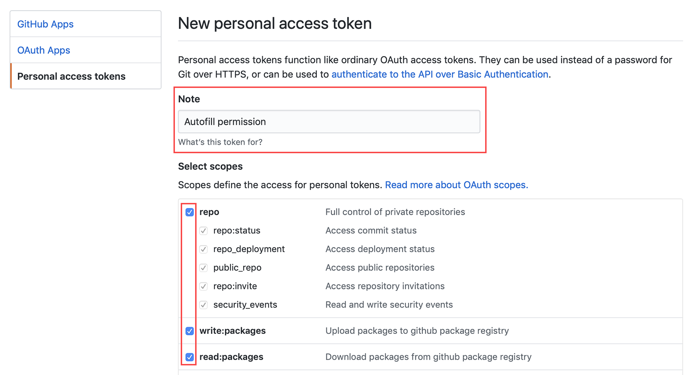

6. You will get your Github token. COPY IT IMMEDIATELY, once you refresh/reload the page, you will not see the code again
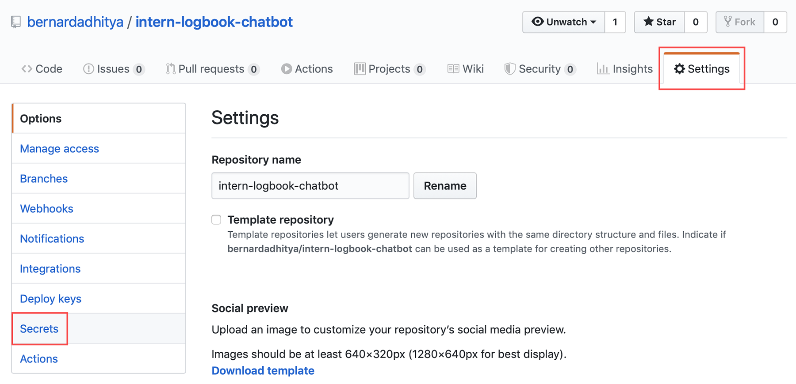

#### Make repository secrets

7. Go back to the repository settings. On the left, you will find a sidebar. Click on "Secrets"
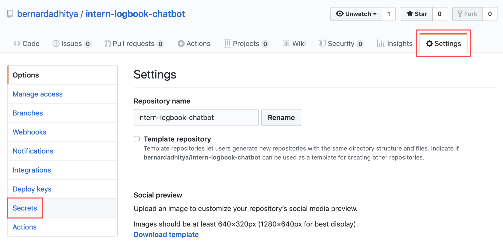

8. Here, you will need to create new secrets. 
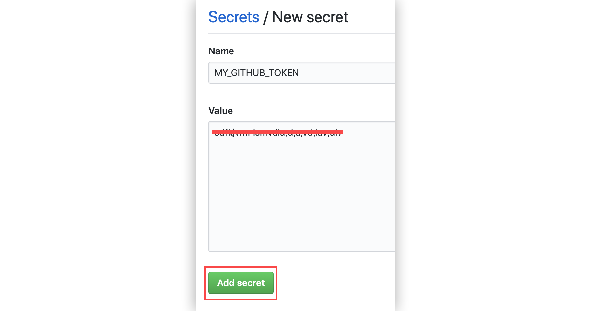

These values are used to access the repository and your logbook page

| Name | Value |
| ---- | ----- |
| `MY_GITHUB_TOKEN` | Paste your github token you previously made |
| `MY_GITHUB_EMAIL` | Your github account email |
| `MY_GITHUB_USERNAME` | Your github username |
| `MY_USERNAME` | Your BINUS ID (NIM) |
| `MY_PASSWORD` | Your account password |
> Secrets are encrypted and is only accessable by the repository in your own account, so it won't be visible to anyone.

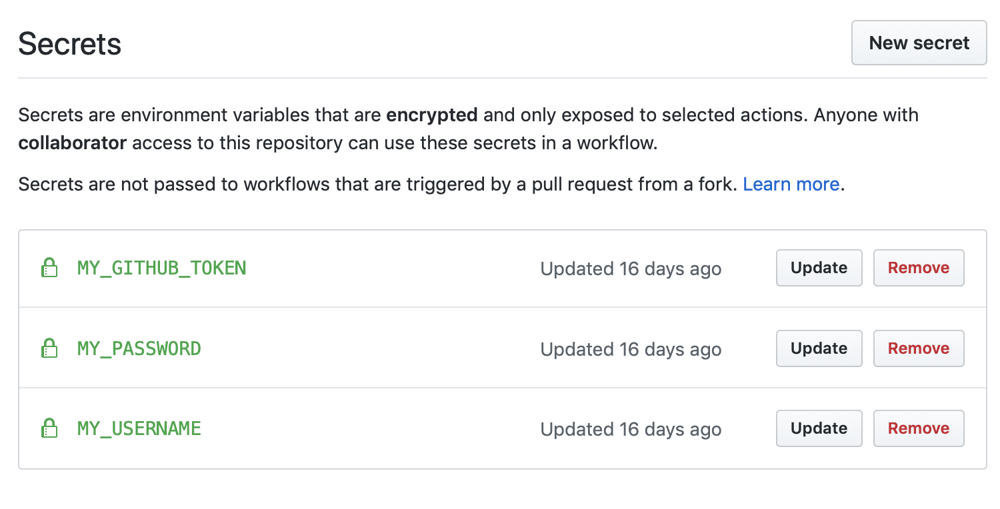

#### Add Github Actions

9. Go to the `main.yml` file (or click [here](https://github.com/bernardadhitya/intern-logbook-chatbot/blob/master/.github/workflows/main.yml)), then copy the whole script
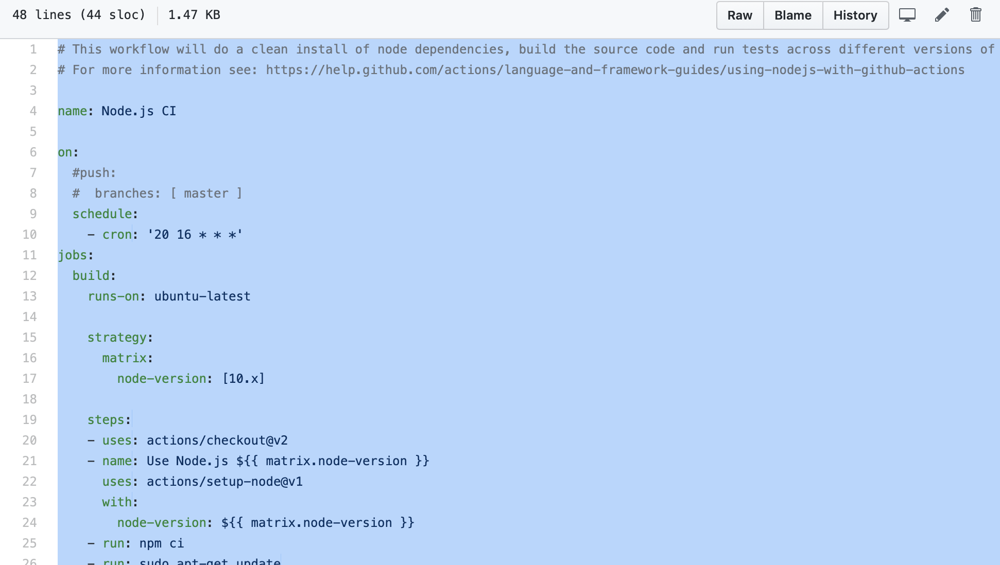

10. Go to the Actions tab, and set a new workflow
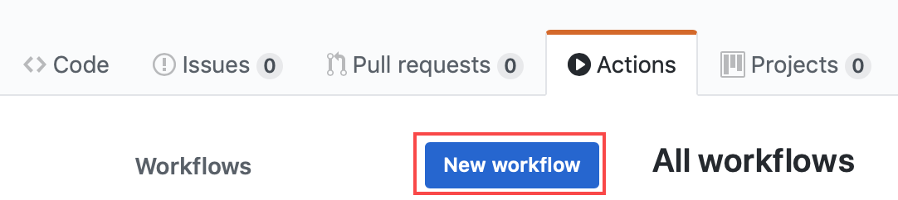

11. Choose "set up workflow yourself"
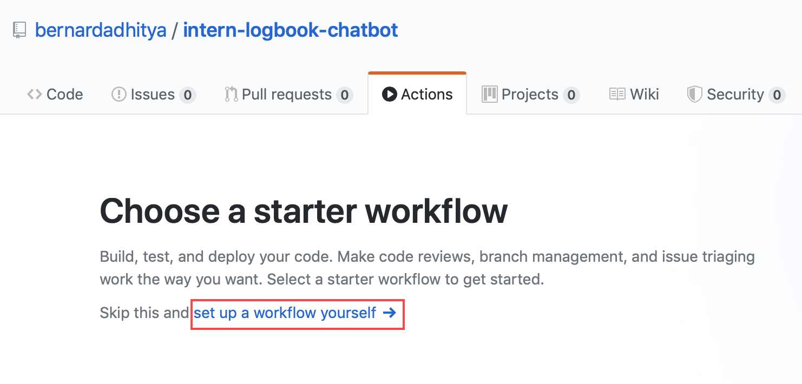

12. Delete the boilerplate and paste the whole script there, and name it `autofill.yml`
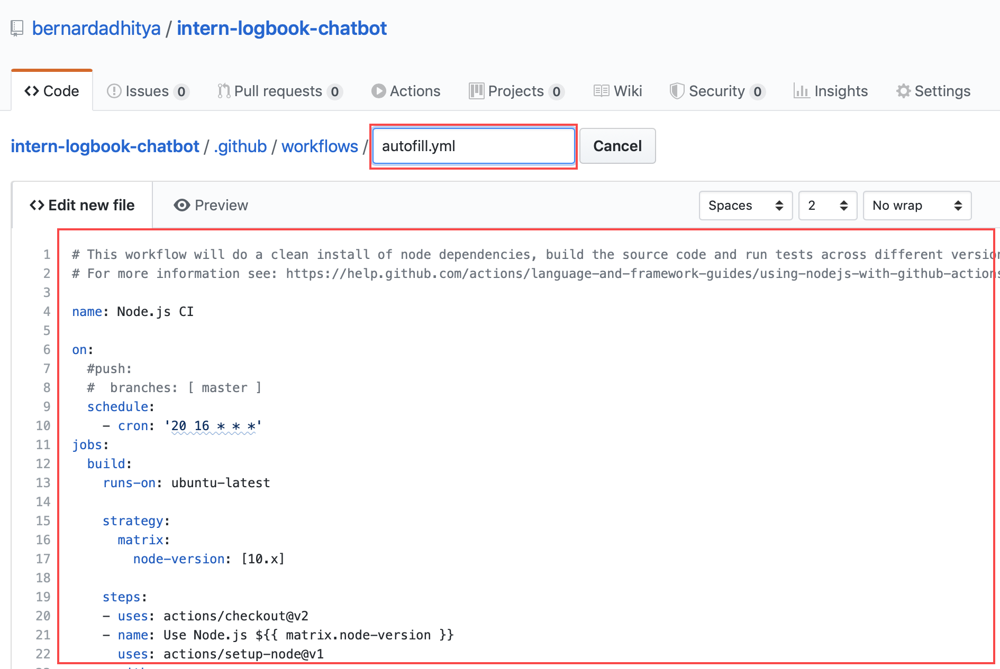

That's it! Github Actions will use that value to access the repository and your logbook account to automatically fill your logbook.

### Preview

