# Deploy LINE Chatbot with LINE Developer and Heroku

### Prerequisite
Before following this tutorial, please make sure to have;
- have done setting up the [autofiller](https://github.com/bernardadhitya/intern-logbook-chatbot/blob/master/docs/autofill-github-actions.md)
- an active Github
- Heroku account 
- LINE Developer account

### Steps
1. Setup the autofiller
2. Integrate the project with Heroku
3. Create LINE Bot channel
4. Connect LINE Bot channel with Heroku via Webhook
5. Give access for Heroku to access your account

### Setup the autofiller
1. In case you missed it, please read the tutorial on how to setup the autofiller [here](https://github.com/bernardadhitya/intern-logbook-chatbot/blob/master/docs/autofill-github-actions.md). The autofiller is used not only to autofill, but also do daily local update on the API to get your latest logbook data.

### Integrate the project with Heroku
2. Login to your Heroku account and create a new app. App name can be anything, as long as its not used by anyone
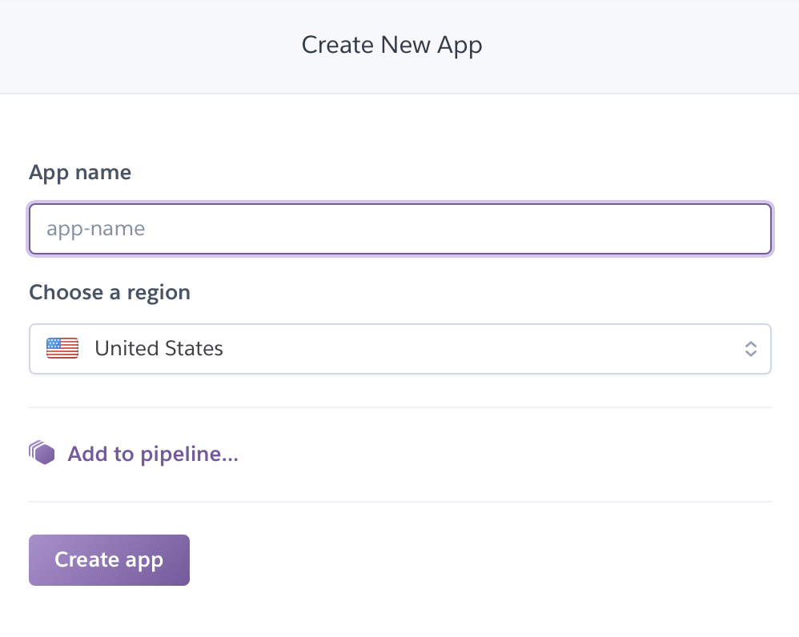

3. Go to "Deploy"

4. Go to "Deployment method" and choose "GitHub". Then redirect it to the forked repository
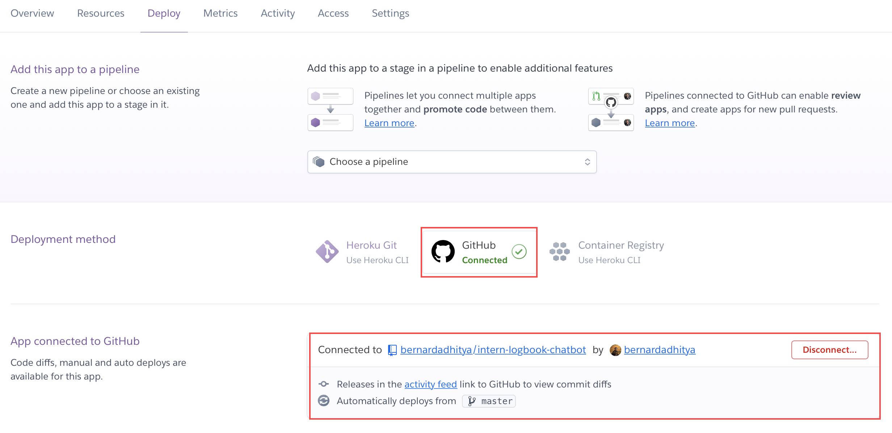

5. Go to "Settings", then scroll to "Buildpacks". nodejs buildpack should be added automatically, otherwise, add it manually. Add `jontewks/puppeteer` buildpack to add support to Puppeteer on Heroku
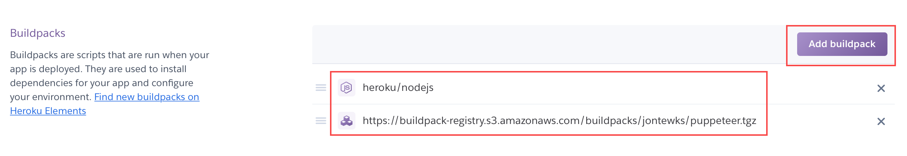

### Create LINE Bot channel
6. Login to your LINE Developer account, then create a Provider. This provider acts as an admin to your LINE Bot
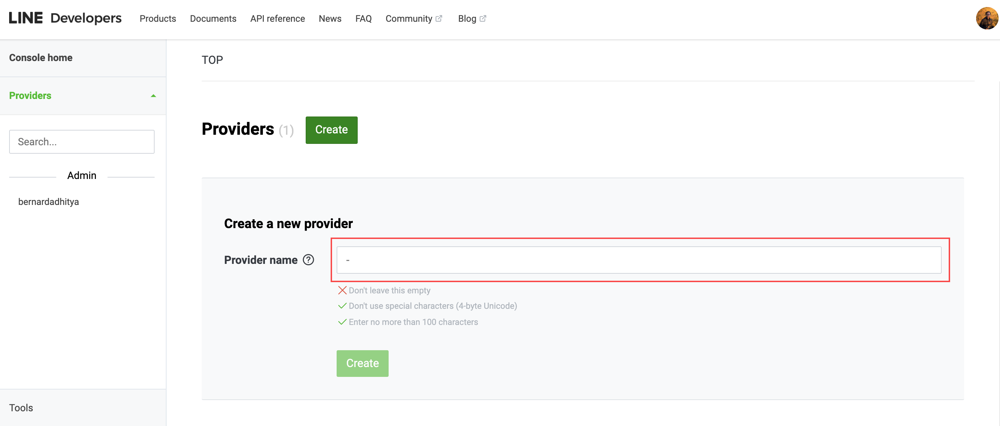
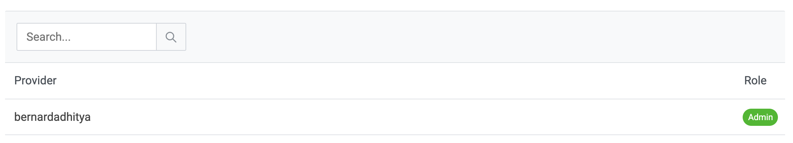

7. Go to "Channels" and choose "Create a new channel"
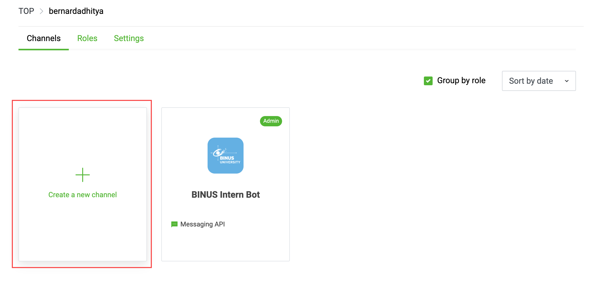

8. Choose "Messaging API"
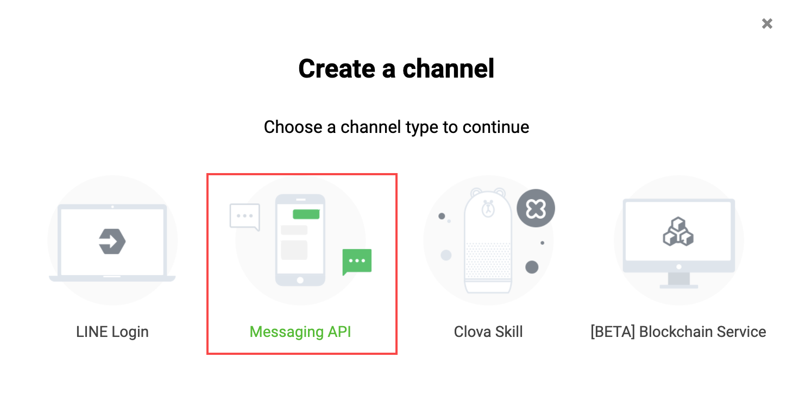

9. Fill in the form to create your channel
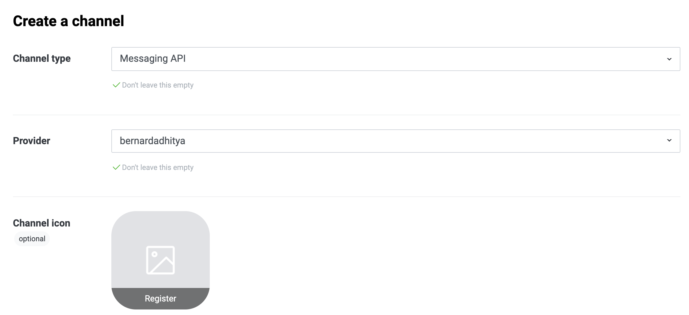

10. Go to "Basic settings"
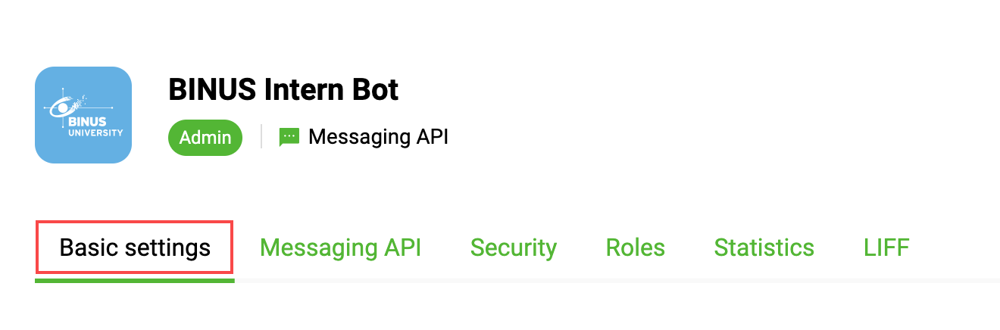

11. Issue a channel secret. Save this channel secret because it is going to be used by Heroku to access your channel

12. Go to Messaging API
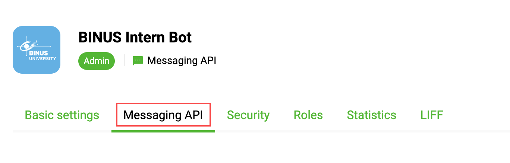

13. Issue a channel access token. Save this channel access token because it is going to be used by Heroku to access your channel
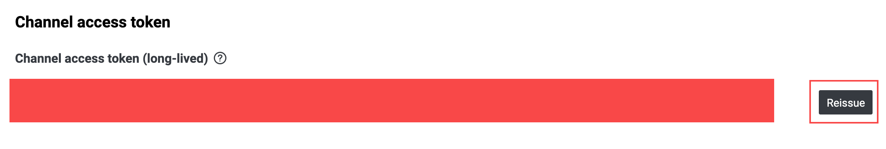

### Connect LINE Bot channel with Heroku via Webhook

14. On "Webhook settings", fill the webhook url with `your-heroku-app-name.herokuapp.com/callback`. Replace `your-heroku-app-name` with your actual Heroku app name you build previously. Don't forget to check the "Use webhook" option
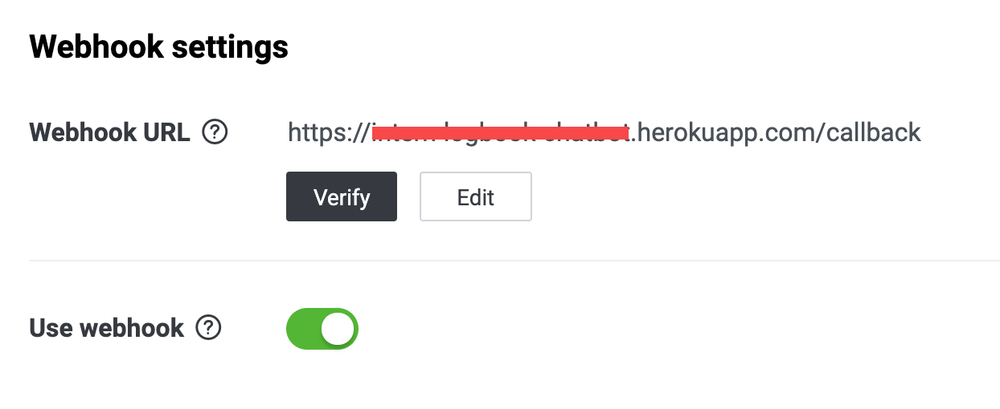

15. Disable bot to join group chats, auto-reply message and greeting message. We want the bot to only reply when we chat the bot directly
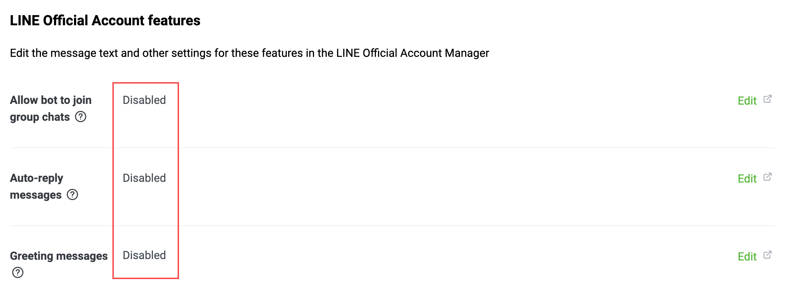

### Give access for Heroku to access your account

16. Go back to Heroku. Go to "Settings" and go to "Config Vars". Fill the config vars with the following;

| Name | Value |
| ---- | ----- |
| `CHANNEL_ACCESS_TOKEN` | Paste your LINE Bot channel access token |
| `CHANNEL_SECRET` | Paste your LINEE Bot channel secret |
| `MY_USERNAME` | Your BINUS ID (NIM) |
| `MY_PASSWORD` | Your account password |

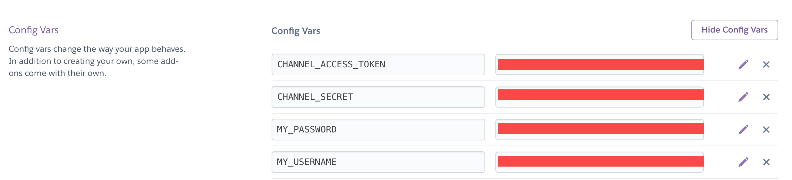

And you're done! Just add your bot to LINE and start using the bot. 
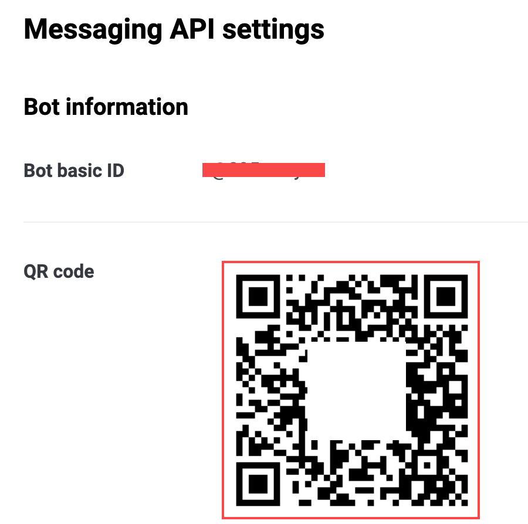

For information on how to use the bot, type '/help'.

PRO TIPS: Wait patiently, the bot will need time to boot up in Heroku server.